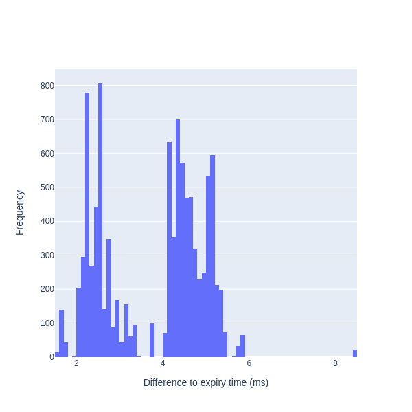

# TimingWheelScheduler-dotnet
A .NET, in-process scheduler based on Timing Wheels. Some good write-ups to the theory behind the timing wheels can be found at [the morning paper](https://blog.acolyer.org/2015/11/23/hashed-and-hierarchical-timing-wheels/) and [the Confluent blog](https://www.confluent.io/blog/apache-kafka-purgatory-hierarchical-timing-wheels/). Timing wheels are also used in prominent frameworks as [Akka.net](https://github.com/akkadotnet/akka.net/blob/984dc9433cb53b932a7de8ac83c597c2e9237eb5/src/core/Akka/Actor/Scheduler/HashedWheelTimerScheduler.cs) and [DotNetty](https://github.com/Azure/DotNetty/blob/dev/src/DotNetty.Common/Utilities/HashedWheelTimer.cs), but built into the frameworks and cannot be easily used right away. Nevertheless, the implementation in this library differs a bit, as the scheduling (writes), collect (bucket collection changes) and expiry checking/per-tick bookkeeping are seperated in different worker tasks, with the rationale to allow a shorter per-tick interval, but yet keep the registration throughput high (and hence allow the timer tasks to have short expiry times), without jeopardizing the accuracy of expiring timer tasks.

Mainly developed to be used in the [Ensemble](https://github.com/ljungloef/Ensemble) library, but also available as a netstandard2.0 lib for anyone in need of a dotnet timer capable of handling _many_, _short-lived_ timer tasks.

Currently only supports a single Hashed Timing Wheel but the intention is to also add support for Hierarchical Timing Wheels.

## Some numbers
When running the [accuracy test sample](samples/Accuracy) on an `Intel Core i7-7700HQ CPU 2.80GHz (Kaby Lake), 1 CPU, 8 logical and 4 physical cores` machine on `ubuntu 20.04` using `.NET SDK=6.0.300` with `10 000` timers splitted into `100` buckets with `10ms` a part, resulted in a delay histogram as:



*Plot produced with [Plotly.NET](https://github.com/plotly/Plotly.NET)*


## Usage
### Create scheduler
```fsharp
open TimingWheelScheduler
open System.Threading // For CancellationTokenSource

use cts = new CancellationTokenSource()
let tickInterval = TimeSpan.FromMilliseconds(10)
let wheelSize = 1024

use scheduler =
  TimingWheelScheduler.create tickInterval wheelSize
  |> Scheduler.start cts.Token
```

### Schedule a timer task using the scheduler
```fsharp
let delay = TimeSpan.FromMilliseconds(600)
let timer = scheduler.Schedule(RunOnce delay, "timer", (printfn "Hello from %s"))
```

### Either, wait for the timer task to expire:
```fsharp
// output "Hello from timer" after ~600ms
```

### Or, request cancellation via the `timer` reference:
```fsharp
timer.Cancel()
```

For a more advanced scenario, take a peek at [the accuracy test sample](samples/Accuracy)

## License
[Apache 2.0](https://raw.githubusercontent.com/ljungloef/TimingWheelScheduler-dotnet/main/LICENSE)